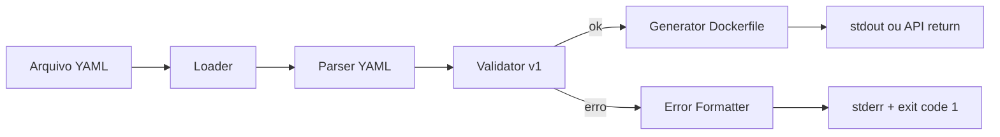

# Design: docker-yaml v1

## Objetivo Tecnico
Transformar YAML v1 em AST validada e depois em `Dockerfile` por um pipeline simples e previsivel.

## Arquitetura Proposta



## Componentes

### 1. Loader
- Responsabilidade: ler arquivo por path.
- Saida: string YAML.

### 2. Parser
- Responsabilidade: converter YAML em objeto JS tipado.
- Dependencia sugerida: `yaml` (npm).

### 3. Validator
- Responsabilidade: validar schema e regras semanticas da v1.
- Estrategia: validar tipos/campos + validacoes por regra (`expose`, `copy`, etc.).
- Saida: lista de erros (vazia quando valido).

### 4. Generator
- Responsabilidade: montar linhas de `Dockerfile` em ordem canonica.
- Regra especial v1: inferir `WORKDIR` do primeiro `copy.dest` absoluto.

### 5. CLI Layer
- `validate`: chama loader+parser+validator.
- `generate`: chama loader+parser+validator+generator.
- Tratamento de erros e codigos de saida.

## Modelo de Dados (v1)
```ts
type DockerYamlV1 = {
  version: 1;
  from: string;
  copy?: Array<{ src: string; dest: string }>;
  run?: string[];
  env?: Record<string, string>;
  expose?: number[];
  cmd?: string[];
};
```

## Decisoes
- Campos desconhecidos sao erro para manter previsibilidade.
- `cmd` usa sempre exec form (`CMD ["..."]`) para evitar ambiguidade de shell.
- Ordem de geracao fixa para evitar diffs ruidosos.

## Tratamento de Erros
- Erros com path do campo (`copy[0].dest`, `expose[0]`).
- CLI imprime resumo + detalhes.

## Testes Planejados
- Unitarios por componente (parser/validator/generator).
- Integracao da CLI com fixtures validos e invalidos.
- Snapshot test para Dockerfile gerado a partir de exemplos.